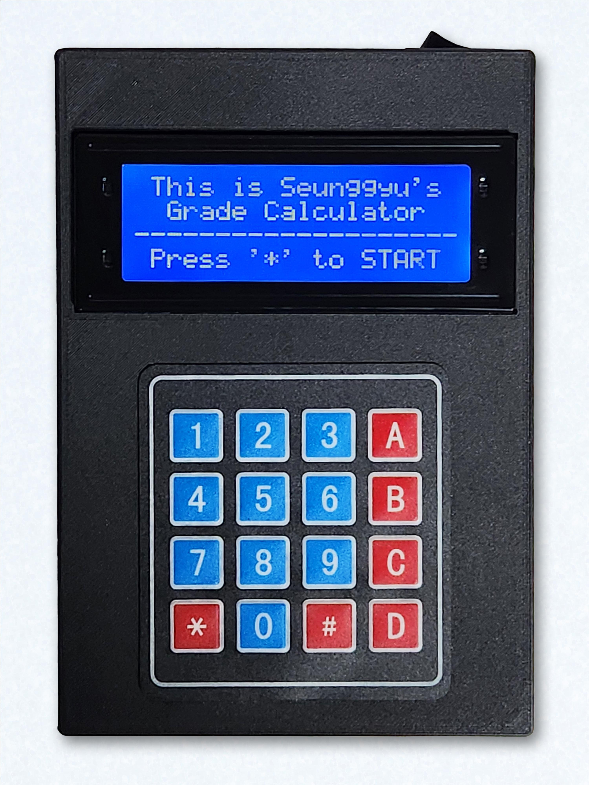
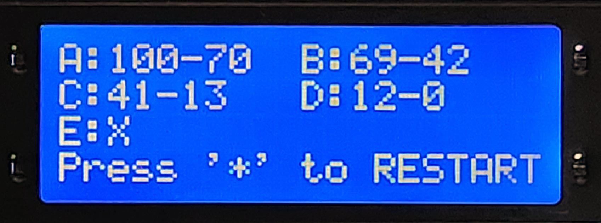
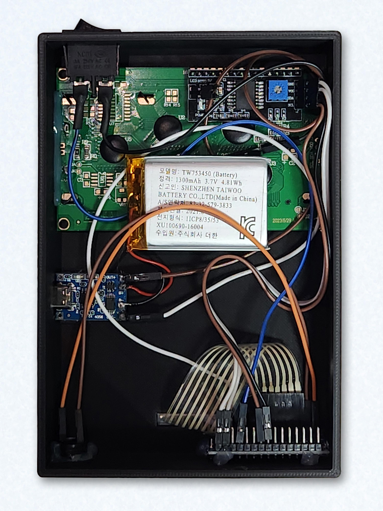

# 점수에 따른 성적 커트라인 계산기 (중학교용)
이미 취득한 1회고사와 수행평가의 점수를 입력하면 마지막 취득하게 될 2회고사의 점수에 따라 받을 수 있는 등급을 한번에 구할 수 있다.

    

 

## 사용방법

1. (1회고사):(수행평가):(2회고사)의 비율을 35:30:35나 30:30:40 중 선택한다.
2. 1회고사의 점수를 입력한다.
3. 수행평가의 점수를 입력한다.
4. 결과를 확인한다.

 

## 사용예시
아래의 결과는 1회고사에 100점을 취득하고 수행평가를 100점을 취득하였을때의 계산 결과이다.  
이 경우 A등급을 받기 위해서는 다음 2회고사에서 100~70점 범위 내의 점수를 취득해야 한다.

    

 

## 사용된 부품

    

|사용된 곳|사용된 부품|사양|
|---|---|---|
|아두이노|아두이노 마이크로(클론)|C타입 IO|
|디스플레이|arduino 2004 lcd i2c|최대 20자 4줄 출력|
|키패드|아두이노 4X4 맴브레인 키패드|숫자와 *,#,A,B,C,D의 문자 입력|
|배터리|TW753450|1300mAh|
|하우징|3D프린트|[STL 파일](./STLs/Housing.stl)|